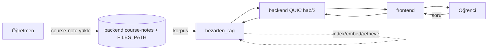

# PROJECT_STATE

> Bu dosya `hezarfen_rag` repo'sunundur. Kardeş repolar: `hezarfen_backend`,
> `hezarfen_frontend`, `Hezarfen-Rule-Based-Chatbot`. RAG (retrieval-augmented
> generation) servisi + özet + guardrail burada; **aktif geliştirmede, uçtan uca
> çalışan + ölçülen boru hattı VAR** (aşağı).

## 0. YENİ MAKİNE + EXP-009 (2026-09-10) — ÖNCE BUNU OKU

> Bu bölüm 2026-09-10 oturumunda eklendi; aşağıdaki §1 (2026-09-05) hâlâ geçerli
> ama **o ölçümler Windows + RTX 4060 CUDA makinesinde** alındı. Şu anki makine
> Fedora Linux ve TAZE bir geri-yükleme.

**Makine durumu (Fedora, 2026-09-10):**
- `data/` **BOŞ** — 2.463 LFS dosyası (15,6 GB) çekilmedi (`git status` hepsini " D" gösterir).
  → ingest/retrieval/eval **koşamaz**; EXP-009 bu yüzden yalnız üreticiyi izole etti.
- **Git kimlik doğrulaması ÇALIŞMIYOR:** 4 depo da private, `gh` CLI **kurulu değil** ama
  git credential helper `!/usr/bin/gh auth git-credential`'a bakıyor → fetch/pull/push
  başarısız. **Çözüm:** `sudo dnf install gh && gh auth login`, sonra `git lfs pull`.
  → Bu yüzden front/back'in `origin/main` ile güncel olup olmadığı **doğrulanamadı**;
  yerel HEAD'ler: backend `06fee28`, frontend `8087fda`, rag `1201eb7`, chatbot `559d04d`.
- **`.venv` KURULDU:** Python **3.13** (3.11 paketi yok), **CPU**-torch 2.14, pymupdf,
  pdfplumber, qdrant-client, rank-bm25, FlagEmbedding, deepeval, fastapi.
  `python -m unittest discover -s tests/unit -t .` → **434 yeşil** (1 skip).
- **GPU ÇALIŞIYOR (2026-09-11 düzeltmesi).** Sürücü baştan beri kuruluydu
  (NVRM 610.57.04, RTX 4060 Laptop 8 GB, CUDA 13.3); `nvidia-smi` Flatpak
  sandbox'ı yüzünden görünmüyordu (host `/run/host` altında). `torch 2.14.0+cu130`
  kuruldu. **Ölçülen:** embed **49,8 chunk/s**, rerank **1,90 s**/40 aday,
  `build_canonical` (194 sayfa) 31,0 s, VRAM tepe 2.627 MB.
- **`tesseract` yok** → OCR yolu (Faz 0.8) bu makinede sınanamaz.
- **`.env` DÜZELTİLDİ:** anahtar adları `DEEP_SEEK_API_KEY ` (fazla `_` + sonda boşluk) ve
  `NVİDİA_APİ_KEY` (Türkçe `İ`) idi → kod **hiçbirini okuyamıyordu**. O gün
  `DEEPSEEK_API_KEY` + `NVIDIA_API_KEY` adları eklendi.
  **2026-09-17 GÜNCELLEMESİ — TEMİZ KESİM:** sağlayıcı adı taşıyan bu iki ad
  KALDIRILDI. Tek ad `LLM_API_KEY`; eski adlardan biri ORTAMDA bulunursa
  LLM istemcisi ve servis açılışı AÇIKÇA REDDEDER (`providers/llm.py::
  reject_retired_env`) — sessiz geri düşüş yok. Modül de sağlayıcı-nötr adla
  yeniden adlandırıldı: `src/providers/deepseek.py` → `src/providers/llm.py`
  (`DeepSeek` sınıfı → `LLMClient`).
  Yedek: oturum scratchpad'inde `.env.bak-20260910`.

**EXP-009 — üretici LLM aday karşılaştırması** (rapor: `docs/reports/EXP-009-uretici-llm-karsilastirma.md`,
ham veri + soru/cevap defteri: `outputs/EXP-009-model-karsilastirma/`), maliyet **$0**:
- **Sağlayıcı artık env'den seçilir** (`LLM_BASE_URL`/`LLM_MODEL`/`LLM_API_KEY`/`LLM_EXTRA_JSON`)
  → `src.eval.runner` dahil tüm sistem kod değişmeden başka bir OpenAI-uyumlu uca alınabilir.
  +15 test (`tests/unit/test_provider_config.py`).
- **`nvidia/nemotron-3-super-120b-a12b`** ve **`meta/muse-glimmer-30b`** başa baş birinci
  (guard zararlı 15/15 + injection 12/12 + 0 yanlış-pozitif; atıf precision **1,000**).
  Ayrım: nemotron **p50 1,94 s** (muse 10,44 s) · muse kaynak-yokken **8/8** çekimser (nemotron 7/8).
- **`nvidia/nemotron-3.5-lightning-30b-a3b` REDDEDİLMELİ:** nefret söylemini "güvenli" saydı
  (2/3), intihar sorusunda **bozuk JSON** → fail-safe allow, jailbreak kaçırdı, dil kirlenmesi
  (`violence_凶手`, `促进하여`), kaynak yokken 7/8 item'da cevap uydurdu.
- **NVIDIA'daki DeepSeek uçları kullanılamaz:** flash 300 s timeout ×3, pro 201,5 s
  (DeepSeek'in kendi API'si 1,0 s).
- **`moonshotai/kimi-k3` ÖLÇÜLEMEDİ:** bu makinede aynı NVIDIA anahtarını kullanan İKİNCİ bir
  oturum (MedExam) kotayı tutuyor; tek çağrı bile anında 429. Tek başına yeniden koşulmalı.
- **KARAR ÖNERİSİ:** üretim modeli ŞİMDİ değişmesin — EXP-009 retrieval'ı ölçmedi. `data/`
  gelince aynı 200-item golden set'le TAM boru hattı üzerinde her aday için `src.eval.runner`.
- **Durum: `İNSAN İNCELEMESİ BEKLİYOR`.**

## 1. Anlık Durum (2026-09-05, checkpoint)
- Aktif branch: `main` (tek-branch, adım adım commit; feature-branch yok)
- **Tek cümle:** Uçtan uca RAG + özet + guardrail + değerlendirme ÇALIŞIYOR ve 200-item
  golden set'e karşı ÖLÇÜLDÜ (retrieval recall@20 0.96, faithfulness 0.99, guardrail
  zararlı/injection 33/33·12/12, kasa izolasyonu 0-sızıntı); vertical slice = 12-biyoloji.
- **Kod (`src/`):** ingest/canonical/chunk + **OCR fallback (Faz 0.8, ocr.py)** + **multimodal VLM captioning (Faz 5, providers/vlm.py + ingest/visual_caption.py)** · embed BGE-M3 GPU (1.2) · index
  Qdrant+BM25 (1.3) · retrieve hibrit RRF + **kasa izolasyonu** (1.4/1.6) · rerank (1.5) ·
  generate **kaynak-sınırlı+atıf+fail-closed** (1.7) · guard **zararlı+injection+rol+LLM-sınıflandırıcı**
  (1.7b) · summarize **kanıtlı özet** (RAPTOR-benzeri) · memory **history-rewrite** · context
  **lost-in-middle+budget** · cache (Response/Embedding) · eval **DeepEval+DeepSeek-hakem** ·
  pricing/costlog + **sorgu-anlama(understand) · observability(trace) · benzer-soru · servis-handler**.
  **419 unit + integration + e2e yeşil.** Açık (ileriye dönük): #25(10k) · #23(multimodal-batch) · #3(EPIC).
- **Değerlendirme:** `tests/golden/golden_12bio_v1.json` (200 item TASLAK, Kadir onayı bekliyor);
  `tests/evaluation/results/` re-baseline'lar; ölçümler Obsidian `deney-sonuclari.md`+`Maliyet.md`.
- **Agentic + optimizasyon:** `.claude/agents/` (Opus+Sonnet) + `docs/ORCHESTRATION.md`+`OPTIMIZATION.md`
  + `reports/RES-001/002/003` (kuzey-yıldızı ürün mimarisi). Sürekli-optimizasyon loop'u aktif.
- **`LLM_API_KEY`** `.env`'de (doğrulandı; eski `DEEPSEEK_API_KEY`/`NVIDIA_API_KEY`
  adları 2026-09-17'de kaldırıldı — varsa servis REDDEDER). **Bekleyen (Kadir):** golden v1.1 onayı + kriz-hattı no'su.
- **Çok-dersli kasa izolasyonu DOĞRULANDI** (EXP-002, 2026-09-06): 4 kitap birleşik indeks, ders+sınıf boyutu **0/800 sızıntı** (129 yabancı chunk filtresiz gelirdi), erişim-denemesi 4/4 fail-closed.
- **Faz 0.8 OCR + özet-PDF TAMAM** (EXP-003, 2026-09-06, commit 5d03c07): OCR fallback (Tesseract-tur, opsiyonel, zarif degradasyon), Türkçe doğruluk kanıtlı; özet-PDF uçtan uca (build_canonical→resolve_scope→summarize, detaylı+atıflı).
- **Faz 5 Multimodal VLM captioning çekirdek TAMAM** (EXP-004, #23, commit d6fb062+a4ea060): sağlayıcı-bağımsız captioner + `build_canonical(vlm=True)`. **DeepSeek API'nin vision modeli var (`deepseek-v4-flash-vision-exp`) → mevcut key yeter.** Canlı kanıt (görsel-sanatlar portre/etkinlik). Backlog: tam-korpus batch, figür-başı granülerlik.
- **Non-bio kalite + ayırt edici metrik TAMAM** (EXP-005, #24, commit 92f53bb): kimya+fizik gold TASLAK ile ölçüldü → **RAG dersler arası genelleşiyor** (recall@20 0.98-1.0, MRR 0.86-0.96, 0 yanlış-çekimser, citation bio bandında, guardrail domain-yakın zararlı 3/3, çekimser 5/5). Ayırt edici metrik = recall@5/@10+MRR.
- **Issue düzeni** (gh CLI): #4/#6/#9/#15/#7 kapandı; #17/#14/#8/#18/#5/#2/#3/#1 güncel; yeni: #23 multimodal✅, #24 metrik+non-bio-gold✅, #25 10k-benchmark(ön-koşullu).
- **Çok-ders özet + multimodal özet** (EXP-006): özet dersler arası genelleşiyor (kimya damıtma-tablolu, fizik ünite özeti, atıflı) ✅; multimodal-özet mimarisi çalışıyor (görsel→kapsam→atıflı özet) ✅ AMA `deepseek-v4-flash-vision-exp` yoğun diyagramda boş içerik (all-reasoning) döndürüyor → güvenilmez. **ÖNERİ:** stabil VLM (Gemini/GPT-4o-mini) VLM_* env ile (kod değişmez).
- **Bekleyen (Kadir):** golden v1.1 (bio) + kimya/fizik gold TASLAK onayı + kriz-hattı no'su + **multimodal için stabil VLM key kararı**.

## 2. Hedef ve Kapsam
- **Ana hedef (niyet, repo adından):** öğretmenin yüklediği ders kaynağı üzerinden öğrencinin RAG ile sohbet edebildiği servis.
- **Tamamlanma tanımı:** kaynak alınır → indekslenir → sorgu retrieval + rerank yapar → kaynak-sınırlı+atıflı cevap üretilir → guardrail + kasa izolasyonu uygulanır. **Vertical slice (12-biyoloji) uçtan uca ÇALIŞIYOR ve ÖLÇÜLDÜ** (§1). Üretim tanımı için kalan: kalıcı store + servis girişi + backend entegrasyonu (bkz. §6).
- **Kapsam dışı:** kaynak YÜKLEME arayüzü/deposu — bu zaten VAR (bkz. §5 D1, course-notes); RAG servisi onu tüketecek, yeniden inşa etmeyecek. Backend/frontend repolarına DOKUNULMAZ.
- **Değiştirilemez kısıt:** tek branch (`main`), commit'lerde AI izi yok (yazar=Kadir); rol SUNUCU-tarafı türetilir (istemciye güvenilmez); pass-bias/over-correction yasak; benchmark/mimari/bulgular kilidi (Kadir onayı). org `Hezarfen-Co`.

## 3. Çalıştırma ve Doğrulama
- **Ortam:** `.venv` (proje-yerel), GPU torch cu124 (RTX 4060, cuda doğrulandı). Modeller: BGE-M3 (embed) + BGE-reranker-v2-m3 (rerank), GPU. `LLM_API_KEY` `.env`'de.
- **Testler (2026-09-17):** `python -m pytest tests/unit -q` → **1278 passed, 34 skipped**
  (CI kapısı bu süittir; integration/e2e korpus + model ister ve kendi kendine atlar).
  Değerlendirme: `python -m src.eval.runner` (golden set'e karşı; `GOLDEN_PATH` ile override).
- **Servis girişi (2026-09-17 durumu):** HTTP servisi VAR — `src/service/http_app.py`
  (FastAPI; `/rag/chat`, `/rag/summarize`, `/rag/questions`, `/health`, `/ready`),
  `compose.yaml` + `Containerfile` + `deploy/hezarfen_rag_compose.service` +
  `.github/workflows/main.yml` (elle tetiklenen VPS deploy). Backend bu HTTP'yi
  ÇAĞIRMAZ; gerçek entegrasyon QUIC `hab/2` köprüsüdür ve **taşıması yazıldı**
  (`src/bridge/transport.py`, ¶11.4) → `rag.chat` artık telden servis edilir;
  `rag.index` hâlâ TİPLİ REDDEDER (`index_path_unwired`).
  Kalıcı Qdrant hâlâ yok (in-memory indeks; #75/RISK-01).

## 4. Mimari Özet
- **Mevcut (uygulandı, `src/`):** ingest/canonical/chunk → embed (BGE-M3 GPU) → index (Qdrant embedded + BM25) → hibrit RRF retrieval + **kasa izolasyonu** → rerank (BGE-reranker) → generate (kaynak-sınırlı + `[N]` atıf + fail-closed) → guard (zararlı + injection + rol + LLM-sınıflandırıcı). Ayrıca: summarize (kanıtlı özet, RAPTOR-benzeri), memory (history-rewrite), context (lost-in-middle + budget), cache (Response/Embedding), eval (DeepEval + DeepSeek-hakem), pricing/costlog.
- **Doğrulanmış kaynak (RAG için hazır girdi):** `course-notes` — öğretmen (kursu yönetebilen) yükler, **kursa kayıtlı öğrenci okur**, dosya ekli (PDF dahil, `FILES_PATH` volume). Backend: `hezarfen_backend/src/web/course_notes.rs`, `src/domain/course_note{,_file}.rs`. Frontend: `hezarfen_frontend/src/api/course-notes/*`.
- **Entegrasyon (2026-09-17 durumu — artık varsayım değil):** backend QUIC
  **`hab/2`** sunucusudur, AI servisleri dial eder. Bu depodaki tel biçimi
  `src/bridge/contract.py` (anahtar adları testle sabitli), transport-BAĞIMSIZ
  dağıtıcı `src/bridge/dispatch.py` (okul zorunlu + cevapta eko; `asker_role` →
  `role`; `rag.chat`/`chat.reply`), **taşıma `src/bridge/transport.py`** (dial-out,
  `Hello`/`Greeting`, `Request` → dağıtıcı → `Response`, PING, üstel geri
  çekilmeyle sonsuz yeniden bağlanma; ¶11.4). Yani `rag.chat` telden servis
  edilir; eksik kalan: `rag.index` (ek dosya baytları + korpus yönlendirmesi) ve
  backend'den OKUMA yolu (`ApiRequest`/`BlobRequest`, bugün çağıranı yok).
  Girdi/çıktı sözleşmesi + kiracılık: `docs/API-CONTRACT.md` §0.3,
  `docs/BACKEND-INTEGRATION.md` §4/§4.1/§4.2.


> Diyagram NİYETİ gösterir. 2026-09-17 durumu: `S → BR → RAG → BR → FE → S`
> yolu ARTIK ÇALIŞIR (taşıma landı, `rag.chat` telden servis edilir). Kesikli
> oklar hâlâ çizilmemiştir çünkü **korpus akışı yok**: `rag.index` tipli
> reddediyor (dosya baytları `BlobRequest` ile okunmuyor), kalıcı Qdrant yok ve
> öğretmenin yüklediği not otomatik indekslenmiyor.

## 5. Teknik Kararlar
- **D1** — RAG kaynağı sıfırdan yükleme alanı GEREKMEZ: `course-notes` (öğretmen→kayıtlı-öğrenci, dosya ekli) doğal korpustur. **kabul edildi** (backend/frontend main'de doğrulandı 2026-08-16). ⚠️ **Çelişki düzeltmesi:** bu oturumun erken RAG cevabı "böyle bir alan yok" idi; o cevap course-notes eklenmeden önceki duruma aitti ve **artık geçersiz** — doğrulanmış gerçek: alan VAR.
- **D2** — Retrieval/embedding/vektör-store/LLM: **KARAR VERİLDİ** — hibrit (dense BGE-M3 + BM25) RRF + BGE-reranker-v2-m3; vektör-store Qdrant (şu an embedded, üretimde kalıcı); generatör DeepSeek (fine-tuning YOK). **kabul edildi + uygulandı + ölçüldü**.
- **D3** — Servis transport: **KARAR VERİLDİ = ayrı HTTP servisi** (Kadir: 'kendi repomuzda backend-hazır'). Uygulandı: `src/service/http_app.py` (FastAPI, API-CONTRACT.md endpoint'leri), canlı smoke OK. Backend bu HTTP'yi çağırır; QUIC-köprü alternatifi backend'e kalır.

## 6. Aktif Görev
- **ID:** TASK-RAG-CHECKPOINT
- **Amaç:** non-blocked optimizasyon kalemleri tamamlandı; Kadir'in yön/onayı bekleniyor.
- **Kabul kriterleri:** karşılandı — uçtan uca boru hattı + 200-item ölçüm + 419 test yeşil + endpoint sözleşmesi.
- **Gerçek test sonucu:** §1 (recall@20 0.96, faithfulness 0.99, guardrail 33/33·12/12, kasa 0-sızıntı).
- **Durum:** `KADİR ONAYI/YÖNÜ BEKLİYOR` — non-blocked iş kalmadı; diminishing returns veri-onaylı.
- **Sonraki kesin işlem:** Kadir yön versin (aşağı §10 menü) VEYA iki bekleyeni çözsün (golden v1.1 onayı + kriz-hattı no'su).

## 7. Görev Kuyruğu (Kadir yönüne bağlı)
- **TASK-GOLDEN-APPROVE** — P1 — golden v1.1 (200 item) Kadir onayı → üretim ölçümü kilidi açılır. dep: Kadir. **BLOCKED**.
- **TASK-CRISIS-LINE** — P1 — self-harm guardrail mesajına kriz-hattı no'su. dep: Kadir. **BLOCKED**.
- **TASK-RAG-SERVICE** — P2 — HTTP servisi + `hab/2` dağıtıcısı + **QUIC taşıması
  TAMAM** (2026-09-17, ¶11.4); kalan: `rag.index` yolunun yazılması (ek dosya
  baytları + korpus yönlendirmesi) ve kalıcı Qdrant (sözleşme:
  `docs/API-CONTRACT.md` §0.3). **KISMİ (eksik: index + kalıcı store)**.
- **TASK-RAG-SCALE** — P3 — Faz 2 RAPTOR ölçek + çok-dersli korpus + özet-PDF/OCR (Faz 0.8). dep: Kadir yönü. **TODO**.
- **TASK-REARCH** — P4 — derin yeniden-mimari (EB-KOS/layout/kalibrasyon) — "optimizasyon fazı", Kadir'e ayrıldı. **DEFERRED**.

## 8. Tamamlanan İşler (son 10)
- **#1/D3 backend-hazır HTTP servisi** (FastAPI: /rag/chat,/summarize,/questions,/health) — canlı smoke: kimya grounded cevap + kasa izolasyon + strict-role. `python -m src.service.http_app`.
- **#8 veri damıtma** (dedup/boilerplate — kimya %6.7, bio %4.0 azaldı).
- Ürün backlog: **#17** e2e · **#14** sorgu-anlama (intent+NER) · **#18** observability (RequestTrace) · **#5** benzer-soru · **#2** servis handler. **419 unit + integration + e2e yeşil.** Yeni modüller: src/{service,understand,observability}, question_gen, ingest/distill.
- **Açık kalan (ileriye dönük):** #25 (10k benchmark — ürün-hazır sonrası), #23 (multimodal tam-korpus batch), #3 (EPIC tracker).
- EXP-007 backlog `#26-#31` HEPSİ ÇÖZÜLDÜ (c5b63b2…): visuals-vektör, ingest-sınıflama, costlog-kilit, eval-robustluk+test, RAPTOR-özyineleme+cache-versiyon, guard-sertleştirme.
- `aeee583` fix(audit EXP-007): 17 güvenlik+doğruluk+robustluk düzeltmesi (kasa fail-closed, guard bypass, ungrounded-abstain); 1000-kullanıcı fuzz 0 crash
- `92f53bb` test(golden): kimya+fizik gold TASLAK + EXP-005 (non-bio kalite: genelleşiyor; ayırt edici metrik)
- `a4ea060`/`d6fb062` feat(ingest): Faz 5 multimodal VLM captioning + EXP-004 (DeepSeek-VL, mevcut key)
- `5d03c07` feat(ingest): Faz 0.8 OCR fallback (Tesseract-tr, opsiyonel) + EXP-003 (özet-PDF uçtan uca)
- `b3a010d` test(guard): EXP-002 çok-dersli kasa izolasyonu (ders+sınıf 0/800 sızıntı, 4 kitap)
- `549c606` docs: RAG servis endpoint sözleşmesi (backend entegrasyonu)
- `b41e5c2` fix(generate): citation precision-nudge + A/B bulgusu (P1 maxed)
- `94177c0` docs: kasa izolasyonu tamam (guardrail #3) + PROJECT_STATE
- (önce) Faz 1.2–1.7 boru hattı + guard/cache/eval/summary/memory/context + 200-item golden + re-baseline'lar.

## 9. Bilinen Hatalar ve Riskler
- **RISK-01** — In-memory store: üretimde kalıcı Qdrant + incremental reindex gerekir (course-notes silme/güncelleme senkronu).
- **RISK-02** — ~~non-bio kalite ölçülmedi + metrik doygun~~ ÇÖZÜLDÜ (EXP-005/#24): kimya+fizik gold TASLAK ile ölçüldü → RAG dersler arası genelleşiyor (recall@20 0.98-1.0, MRR 0.86-0.96, 0 yanlış-çekimser, guardrail 3/3); ayırt edici metrik = recall@5/@10+MRR. Vertical slice hâlâ 12 sınıfı; başka sınıflar + özet çok-ders kalan.
- **RISK-03** — Golden set TASLAK (Kadir onayı yok) → üretim eşikleri henüz kilitlenemez.
- **NOT** — GitHub MCP bu oturumda bağlanamadı (auth header); issue akışı (kural 19) commit-referansıyla sonra bağlanacak.

## 10. Son Oturum Devri
- **Bu oturumda:** citation-precision P1 A/B ile maxed (b41e5c2); endpoint sözleşmesi yazıldı (549c606); PROJECT_STATE §2–10 gerçek olgun duruma güncellendi.
- **Değiştirilen dosyalar:** `src/generate/prompt.py`, `docs/OPTIMIZATION.md`, `docs/API-CONTRACT.md`, `PROJECT_STATE.md`.
- **Bekleyen (Kadir):** golden v1.1 onayı + kriz-hattı no'su.
- **Kadir'in yön menüsü:** (a) iki bekleyeni çöz → üretim ölçümü; (b) servis endpoint'i + kalıcı store (D3 kararı); (c) çok-dersli/RAPTOR ölçek; (d) özet-PDF/OCR (Faz 0.8); (e) derin yeniden-mimari fazı; (f) loop'u sürdür.
- **Yeni sohbetin ilk kesin adımı:** bu dosyayı oku; non-blocked optimizasyon bitti — Kadir §10 menüsünden yön verene dek yeni büyük iş başlatma (churn yasak). Küçük doğrulama/ölçüm serbest.

## 11. Kiracılık + kapasite + veri sahipliği (2026-09-17)

### 11.1 Kiracılık (okul) — istek taşır, env seçmez

`b2ba173` ile landi: korpus anahtarı `(okul, sınıf, ders)`, zorunlu yazma sahibi,
tam-eşitlik okuma süzgeci, cevap-cache anahtarına okul, istek-taşınan okul ve
transport-bağımsız `hab/2` dağıtıcısı (okul çerçevede zorunlu, cevapta eko).
Sözleşme tablosu: `docs/API-CONTRACT.md` §0.3 + `docs/BACKEND-INTEGRATION.md`
§4.1. Süit: **1278 yeşil / 34 skip**.

### 11.2 Kapasite — bellek sürücüleri + VERDICT (uygulanmadı; karar kullanıcının)

Bellek sürücüleri (yerel/GPU yolunun bugünkü hâli):

| sürücü | yer | ölçü |
|---|---|---|
| BGE-M3 gömme (yerel) | `src/embed/embedder.py:117-122` | indirme ~2,2 GB; GPU VRAM tepe 2.627 MB (ölçüldü) |
| BGE-reranker-v2-m3 (yerel) | `src/rerank/reranker.py:62-116` | indirme ~1,0 GB; 40 aday GPU 1,90 s / CPU **95,9 s** |
| torch çalışma zamanı | `Containerfile:47-52`; import `src/service/http_app.py:442` (`cuda_status`) | CPU tekerleği import RSS **395 MB** (bu makinede ölçüldü) |
| korpus başına indeks | `src/index/dense.py`, `src/index/lexical.py`, `src/retrieve/sparse.py` | **+529 MB / 10k chunk** (EXP-010 OPS-09, `docs/reports/EXP-010-urun-hazirlik-denetimi.md:114`) |
| korpus sayısı çarpanı | `src/service/multi.py:49-51` (`RAG_MAX_CORPORA` valfi) | RSS korpus sayısıyla lineer (#75) |
| disk | `compose.yaml` `x-rag-envelope` (`disk_min_gb`) | API yolunda model indirilmez: imaj ~2 GB + rollback kopyası + korpus → eşik **8 GB**. Yerel yol 4,5 GB model daha ister |

**Reranker'ın API modu VAR** (gömmelerdeki gibi): `src/rerank/provider.py:75-96`
(`ApiReranker`, Cohere/Jina uyumlu `results[].index`+`relevance_score`), seçim
`RAG_RERANK_PROVIDER=api`. `calibrated_scores=False` olduğu için açılışta
`check_abstain_compatibility` REDDEDER → `RAG_ALLOW_UNCALIBRATED_ABSTAIN=1`
(ya da `RAG_ABSTAIN_SCORE=0`) gereklidir.

**VERDICT: EVET** — API gömme + API rerank ile rag 7,6 GiB'e **sığar**. Yerel
modeller hiç import edilmez (ikisi de `_load()` içinde tembel); ama `cuda_status`
yüzünden torch yine import edilir (~0,4 GB). Ölçülen taban: ~0,1 GB web
bağımlılıkları + 0,53 GB/10k chunk → tek 10-biyoloji korpusu ≈ **1,1 GB**,
3× 10k-chunk korpus ≈ **2,6 GB**. Anahtar kapasite kaldıraçları:
`RAG_MAX_CORPORA` (yüklenen korpus tavanı) ve `RAG_CACHE_PATH` (boş = kapalı).

Bu yolu açan env anahtarları (hepsi `.env.example`'da belgeli):

```
RAG_EMBED_PROVIDER=api            RAG_EMBED_API_BASE=<OpenAI-uyumlu /v1>
                                  RAG_EMBED_MODEL=<model id>
                                  RAG_EMBED_API_KEY=<anahtar>   # ya da RAG_EMBED_API_KEY_ENV=<ad>
RAG_RERANK_PROVIDER=api           RAG_RERANK_API_URL=<ör. https://api.cohere.com/v2/rerank>
                                  RAG_RERANK_MODEL=<model id>
                                  RAG_RERANK_API_KEY=<anahtar>  # ya da RAG_RERANK_API_KEY_ENV=<ad>
RAG_ALLOW_UNCALIBRATED_ABSTAIN=1  # (ya da RAG_ABSTAIN_SCORE=0)
RAG_MAX_CORPORA=2                 # bellek valfi (#75)
```

UYGULANDI (2026-09-17, deploy lane) — API yolu artık **DAĞITIM VARSAYILANI**:
`Containerfile` ENV `RAG_EMBED_PROVIDER=api` + `RAG_RERANK_PROVIDER=api`,
operatör dosyası şablonu `deploy/hezarfen_rag.env.example` (düz `KEY=value`;
systemd satır-içi `#` yorumunu DEĞERE katar). Kaynak zarfı **tek kaynak**:
`compose.yaml` → `x-rag-envelope` (`mem_limit_mb: 3072`, `disk_min_gb: 8`) →
ürün servisi `mem_limit: 3221225472` bayt; CI kapasite kapısı bu sayıları
compose'dan okur (eski 12.000 MB / 20 GB eşikleri model çağından kalmaydı).
3072 MB seçildi çünkü ölçülen tepe 3×10k chunk'ta ≈2,6 GB ve `3g` bu
sağlayıcıda ONDALIK 2,86 GiB'e denk gelirdi.

KÜÇÜK İMGE (aynı gün, kullanıcı kararı): varsayılan imge torch/FlagEmbedding/
ağırlık TAŞIMAZ; bağımlılık listesi bölündü (`requirements.txt` = servis yolu,
`requirements-local.txt` = yerel yığın, `requirements-eval.txt` = yalnız
CI/geliştirme). Yerel yol bir EKLENTİ VOLUME'u olarak açılır:
`deploy/provision_local_stack.sh` (pip İMGE İÇİNDE koşar — ABI/glibc uyumu şart;
idempotent; volume'a `PROVISIONED` sürüm işareti yazar), `.env`:
`RAG_LOCAL_VENV=/local-stack/venv` + `RAG_LOCAL_MODELS_DIR=/models`,
geçiş = `systemctl --user restart hezarfen_rag_compose` (workflow/derleme YOK).
`cuda_status` artık torch'u YALNIZ kuruluysa import eder; `local` seçilip yığın
yoksa servis açılışta adıyla+komutuyla reddeder (ImportError değil).
RAM DÜRÜSTLÜĞÜ: yerel mod ~4,5 GB ister → 7,6 GiB'lik sunucuda "diğer servisleri
kapat" modudur; API modu 1,1-2,6 GB'dır ve varsayılandır.

YEREL YOL KORUNDU (silinmedi, ölçüm yolu aynı): `RAG_EMBED_PROVIDER=local` +
`RAG_RERANK_PROVIDER=local` iki satırla geri dönülür; FABRİKA varsayılanı hâlâ
`local`, yani eval koşuları ve golden-set ölçümleri env'siz eskisi gibi çalışır
(`tests/unit/test_providers_switch.py` + `tests/unit/test_providers_deploy.py`).

Açılış ön denetimi (`src/service/preflight.py`, `python -m src.service.preflight`):
eksik taban adresi/model/anahtar servisi **ayağa kaldırmaz** (SystemExit 2,
`/health` hiç `ok` demez) — "yeşil görünüp ilk gerçek soruda düşen servis"
sınıfı kapandı. Anahtar doğrudan (`RAG_*_API_KEY`) ya da
`RAG_*_API_KEY_ENV=<DEĞİŞKEN>` dolaylı verilebilir.

Dürüst uyarılar (değişmedi): (1) API gömme BGE-M3'ün SPARSE ayağını keser →
ölçülmüş kalite sayıları geçersiz; (2) rerank API skorları çekimserlik eşiği
için kalibre değildir → operatör dosyasındaki
`RAG_ALLOW_UNCALIBRATED_ABSTAIN=1` bir "riski biliyorum" beyanıdır; (3) sunucu
7,6 GiB'i backend+postgres+frontend+chatbot ile PAYLAŞIR → `RAG_MAX_CORPORA`
valfi açık tutulmalı.

#### Sahadaki sağlayıcı: VOYAGE (2026-09-17, ücretsiz kota tercihi)

Kullanıcı "ücretsiz olanları kullan" dedi; `voyage` yolu eklendi (Cohere yedeği
SİLİNMEDİ, `COHERE_API_KEY` yedek anahtar olarak duruyor). Ölçülen sözleşme —
üçü de canlı doğrulandı, varsayım yok:

| ne | ölçüm |
|---|---|
| gömme ucu | `POST {RAG_EMBED_API_BASE}/embeddings`, `data[].embedding`, **1024 boyut** (`voyage-multilingual-2`) |
| `input_type` | Voyage `passage`ı **REDDEDİYOR**: 400 "accepted values are 'query' or 'document'" → kod `passage`ı `document` olarak gönderir (`VOYAGE_INPUT_TYPES`) |
| rerank yanıtı | `data[]` (`index` + `relevance_score`) — Cohere `results[]` idi, ikisi de kabul |
| rerank sınır alanı | Voyage `top_k` ( `top_n` → 400 "not supported"); Cohere `top_n` (`top_k` → 422) → ad uçtan çözülür |

Kod: `src/embed/provider.py` (`VoyageEmbedder`, `INPUT_TYPES` eşlemesi,
`_BoyutKapisi`), `src/rerank/provider.py` (`data[]` kabulü + `top_k_field`),
`src/service/preflight.py` (`_EMBED_API = ("api", "cohere", "voyage")`).
ÜCRETSİZ KOTA İDDİASI: **belgelenmiş, ölçülmemiş** (sağlayıcının fiyat sayfası
kendi içinde tutarsız); kontrol yeri panelin kullanım/faturalama ekranı.

### 11.3 Veri sahipliği — türev store'lar (standing rule)

- Qdrant (embedded, in-memory: `src/index/dense.py:39`) + SQLite cevap cache
  (`src/cache/base.py:110`, `RAG_CACHE_PATH` boşken KAPALI) **türevdir**: backend
  içeriğinden kurulur, silinmesi yalnız yeniden indeksleme maliyeti getirir.
  Kalıcı/tek-kopya veri YOKTUR.
- Uygulama veritabanına erişim YOKTUR. 2026-09-17'de arandı, üç desenin üçü de
  **SIFIR sonuç**: (1) bir Postgres DBAPI/SQLAlchemy Python sürücüsü adı,
  (2) `postgres` DSN şeması (`postgres` + `://`), (3) DSN taşıyan bir ortam
  değişkeni adı. Yani bu depo hiçbir koşulda uygulama DB'sine bağlanmaz;
  Qdrant/SQLite yalnız yerel türev store'lardır.

### 11.4 Köprü taşıması — `src/bridge/transport.py` (2026-09-17, BL-010 kapandı)

Backend QUIC **sunucusudur**, servis dial-out eder. Taşıma: sertifikayı
`GET /ai/certificate` ile çeker (HER yeniden bağlanmada — backend her boot'ta
yeniden üretir), ALPN `hab/2` ile bağlanır, kontrol akışına `Hello`
(`{protocol, service, capabilities, token, max_concurrent}`) yazar, `Greeting`i
okur, QUIC PING ile canlı kalır ve backend'in açtığı her akıştaki `Request`i
transport-bağımsız dağıtıcıya verip tek `Response` yazar. Her hatada üstel geri
çekilmeyle (jitter'li) yeniden dener — **süreç ASLA çıkmaz.**

| ne | nerede |
|---|---|
| ilan edilen yetenekler | `rag.chat` + `rag.index` (`chat.reply` KARŞILANIR ama İLAN EDİLMEZ — o yetenek chatbot'undur) |
| boot politikası | backend yokken süreç ayakta kalır, loglar, bekler; backend gelince KENDİLİĞİNDEN kaydolur. `AI_SHARED_TOKEN` yoksa da denenir (uydurma token YOK; `unauthorized` → bekleme tavana çekilir) |
| nerede koşar | uvicorn sürecinin İÇİNDE ayrı bir arka plan thread'i (`http_app.create_app_with_warmup` → `transport.start_in_background`) — HTTP yüzeyi taşımadan bağımsız |
| TLS | `AI_TLS_FINGERPRINT` dolu → PEM'den hesaplanan SHA-256 pinlenir, uyuşmazsa BAĞLANILMAZ; boş → TOFU, her açılışta `warn` |
| testler | `tests/unit/test_bridge_transport.py` (sahte QUIC sunucusu: `tests/unit/_fake_bridge.py`, aioquic, 127.0.0.1; ağ/DB/model YOK) |

**Ortam (filo adları — yeni ad icat edilmedi):** `AI_BRIDGE_HOST` ·
`AI_BRIDGE_PORT` · `AI_BACKEND_URL` · `AI_TLS_SERVER_NAME` · `AI_SERVICE_NAME` ·
`AI_SHARED_TOKEN` · `AI_TLS_FINGERPRINT` · `AI_MAX_CONCURRENT` ·
`AI_RECONNECT_SECS` · `AI_RECONNECT_MAX_SECS` · `LOG_LEVEL` (ayrıntı:
`docs/BACKEND-INTEGRATION.md` §4.2).

**KAPSAM DIŞI (bilinçli, yalan söylenmiyor):**
- `rag.index` hâlâ TİPLİ REDDEDER (`index_path_unwired`): dizin yazımı ek dosya
  baytlarını (`BlobRequest`) ve korpus yönlendirmesini ister — yazılmadı.
- Backend'den OKUMA yolu (`ApiRequest`/`BlobRequest`) QUIC üzerinden
  bağlanmadı: bugünkü iki yetenek de onu istemiyor (`rag.chat` kapsamı
  çerçevede), yani çağıranı olmayan bir yol yazılmadı.
- **Canlı bir backend'e karşı uçtan uca koşum YAPILMADI** (bu oturumda ayakta
  backend yoktu): kanıt sahte sunucuyla alınan gerçek QUIC el sıkışmasıdır
  (kayıt, istek→dağıtım→cevap, tipli redler, kopma→yeniden kayıt,
  backend-yokken boot).
