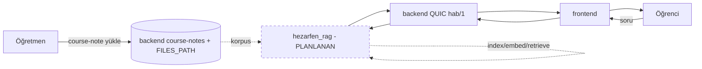

# PROJECT_STATE

> Bu dosya `hezarfen_rag` repo'sunundur. Kardeş repolar: `hezarfen_backend`,
> `hezarfen_frontend`, `Hezarfen-Rule-Based-Chatbot`. Bu repo şu an **boş bir
> placeholder**; büyük projenin planlanan RAG (retrieval-augmented generation)
> servisi burada yaşayacak.

## 1. Anlık Durum
- Son güncelleme: 2026-08-16 (saat: DOĞRULANMADI)
- Aktif branch: `main`
- Son commit: `ca08ad9 Initial commit` (yalnız `README.md`, tek satır: `# hezarfen_rag`)
- Çalışma ağacı: **temiz** (`git status --porcelain` boş)
- Tek cümle (GÜNCEL 2026-08-29): **Veri + maliyet altyapısı + mimari plan HAZIR; RAG boru hattı henüz yok.**
  - **Veri:** `data/` (git-ignored) — tüm ders/sınıf; lise 4-kaynak (kitap+kazanım+özet+defter+soru), ortaokul kitap. 12-bio: 187s kitap, 17 özet, f1-f8 defter, 720 soru (cevap anahtarlı; gövdeler eksik).
  - **Kod:** `src/` (pricing + providers/deepseek + costlog) + `tests/` (unit/integration/e2e, 7 test yeşil). İndirme araçları: `eba_dl/` (git-ignored).
  - **Plan/mimari:** Obsidian `Documents/Hezarfen/rag/`: [[mimari]], [[plan]] (fazlı küçük adımlar), [[benchmark]] (katı kapılar), [[Maliyet]] (otomatik).
  - **Karar:** DeepSeek v4-flash, fine-tune YOK. Mimari: adaptive+hibrit+hiyerarşik+(sonra)multimodal RAG. Sıradaki: Faz 0.3 (12-bio PDF parse + cevap-anahtarı izolasyonu).

## 2. Hedef ve Kapsam
- **Ana hedef (niyet, repo adından):** öğretmenin yüklediği ders kaynağı üzerinden öğrencinin RAG ile sohbet edebildiği servis.
- **Tamamlanma tanımı:** DOĞRULANMADI — henüz tanım/tasarım dosyası yok. Kabaca: kaynak alınır → indekslenir → öğrenci sorgusu retrieval yapar → cevap üretilir.
- **Kapsam dışı:** kaynak YÜKLEME arayüzü/deposu — bu zaten VAR (bkz. §5 D1, course-notes); RAG servisi onu tüketecek, yeniden inşa etmeyecek.
- **Değiştirilemez kısıt:** DOĞRULANMADI (repo boş). Proje geneli: her değişiklik ayrı branch + PR; Podman (Docker değil); org `Hezarfen-Co`.

## 3. Çalıştırma ve Doğrulama
- Kurulum komutu: **BİLİNMİYOR** (dependency manifesti yok — `requirements.txt`/`pyproject.toml`/`package.json`/`Cargo.toml` yok).
- Çalıştırma / test / lint / build: **BİLİNMİYOR** (kod yok). Kök `../compose.yaml` içinde `rag` referansı YOK (servis stack'e bağlı değil).

## 4. Mimari Özet
- **Mevcut:** yok (yalnız `README.md`).
- **Doğrulanmış kaynak (RAG için hazır girdi):** `course-notes` — öğretmen (kursu yönetebilen) yükler, **kursa kayıtlı öğrenci okur**, dosya ekli (PDF dahil, `FILES_PATH` volume). Backend: `hezarfen_backend/src/web/course_notes.rs`, `src/domain/course_note{,_file}.rs`. Frontend: `hezarfen_frontend/src/api/course-notes/*`.
- **Entegrasyon deseni (PLANLANAN / DOĞRULANMADI):** Çelebi chatbot'u gibi backend'in QUIC "hab/1" köprüsüne dial-in edip bir capability (ör. `rag.reply`) register etmesi olası (bkz. `hezarfen_backend/src/ai/registry`). Bu bir varsayımdır; repoda kanıt YOK.

> Diyagram NİYETİ gösterir; `RAG` kutusu ve kesikli oklar henüz **uygulanmadı**.

## 5. Teknik Kararlar
- **D1** — RAG kaynağı sıfırdan yükleme alanı GEREKMEZ: `course-notes` (öğretmen→kayıtlı-öğrenci, dosya ekli) doğal korpustur. **kabul edildi** (backend/frontend main'de doğrulandı 2026-08-16). ⚠️ **Çelişki düzeltmesi:** bu oturumun erken RAG cevabı "böyle bir alan yok" idi; o cevap course-notes eklenmeden önceki duruma aitti ve **artık geçersiz** — doğrulanmış gerçek: alan VAR.
- **D2** — Retrieval/embedding/vektör-store/LLM seçimi: **BİLİNMİYOR** (henüz karar yok). önerildi bile değil.
- **D3** — Köprü mü / kendi HTTP API'si mi: **BİLİNMİYOR**. Backend tarafı TASK-BE-RAG olarak kuyrukta.

## 6. Aktif Görev
- **ID:** TASK-RAG-SCAFFOLD
- **Amaç:** RAG servisini tasarla + iskeletini kur (dil/çatı, ingest yolu, retrieval, backend bağlantısı).
- **Kapsam:** teknoloji kararı → dependency manifesti → course-notes'tan ingest → embedding+vektör store → retrieval → backend'e cevap yolu.
- **İlgili dosyalar:** (henüz yok) — kaynak tarafı: backend `course_notes.rs`, `src/ai/*`.
- **Bağımlılıklar:** D2/D3 kararları (kullanıcıdan/tasarımdan).
- **Kabul kriterleri:** DOĞRULANMADI — henüz tanımlanmadı; tasarım kararı sonrası ölçülebilir kriter yazılacak.
- **Doğrulama komutları:** henüz yok.
- **Gerçek test sonucu:** yok (kod yok).
- **Kalan iş:** tümü.
- **Durum:** `BLOCKED` — teknoloji/mimari kararı (D2/D3) verilmeden ve kullanıcı onayı alınmadan iskelet kurulamaz.
- **Sonraki kesin işlem:** kullanıcıya RAG mimari kararlarını sor (dil/çatı, embedding+vektör store, backend'e QUIC-capability mi HTTP mi), sonra manifest + iskeleti kur.

## 7. Görev Kuyruğu
- **TASK-RAG-SCAFFOLD** — P1 — servis iskeleti + teknoloji kararı. dep: kullanıcı kararı. **BLOCKED**. kabul: TBD.
- **TASK-RAG-INGEST** — P2 — course-notes korpusunu (metin çıkarma + chunk + embed) indeksle. dep: SCAFFOLD. **TODO**.
- **TASK-RAG-RETRIEVE** — P2 — sorgu → retrieval → cevap; backend köprüsüne bağla. dep: INGEST. **TODO**.

## 8. Tamamlanan İşler (son 10)
- `ca08ad9` Initial commit — yalnız `README.md`. Başka iş yok.

## 9. Bilinen Hatalar ve Riskler
- **RISK-01** — Repo boş; tüm mimari/karar açık. Yanlış varsayımla başlamamak için önce kullanıcı kararı gerekir.
- **NOT** — course-notes'ta silme/güncelleme olduğunda RAG indeksinin senkron kalması ileride bir tasarım riski (henüz erken).

## 10. Son Oturum Devri
- **Bu oturumda:** repo boş placeholder olarak doğrulandı (`git log`: tek commit). RAG kaynağı sorusu araştırıldı ve **course-notes** doğrulandı → erken "alan yok" cevabı düzeltildi (§5 D1).
- **Değiştirilen dosyalar:** yalnız `PROJECT_STATE.md` (yeni).
- **Çalıştırılan komutlar:** `git log`/`status`; backend/frontend'de course-notes doğrulaması (grep/glob).
- **Tamamlanmamış:** her şey — servis henüz yok.
- **Açık sorular:** dil/çatı? embedding + vektör store? backend'e bağlantı (QUIC capability `rag.reply` mi, ayrı HTTP mi)? kaynak kapsamı yalnız course-notes mi?
- **Yeni sohbetin ilk kesin adımı:** bu dosyayı oku; RAG'a başlamadan ÖNCE §10 açık sorularını kullanıcıya sor (kod yazma). Kaynak tarafını görmek için `hezarfen_backend/src/web/course_notes.rs` ve `hezarfen_backend/src/ai/`'a bak.
