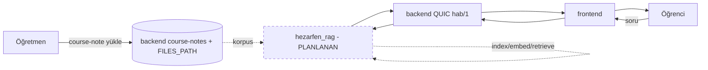

# PROJECT_STATE

> Bu dosya `hezarfen_rag` repo'sunundur. Kardeş repolar: `hezarfen_backend`,
> `hezarfen_frontend`, `Hezarfen-Rule-Based-Chatbot`. RAG (retrieval-augmented
> generation) servisi + özet + guardrail burada; **aktif geliştirmede, uçtan uca
> çalışan + ölçülen boru hattı VAR** (aşağı).

## 1. Anlık Durum (2026-09-05, checkpoint)
- Aktif branch: `main` (tek-branch, adım adım commit; feature-branch yok)
- **Tek cümle:** Uçtan uca RAG + özet + guardrail + değerlendirme ÇALIŞIYOR ve 200-item
  golden set'e karşı ÖLÇÜLDÜ (retrieval recall@20 0.96, faithfulness 0.99, guardrail
  zararlı/injection 33/33·12/12, kasa izolasyonu 0-sızıntı); vertical slice = 12-biyoloji.
- **Kod (`src/`):** ingest/canonical/chunk + **OCR fallback (Faz 0.8, ocr.py)** + **multimodal VLM captioning (Faz 5, providers/vlm.py + ingest/visual_caption.py)** · embed BGE-M3 GPU (1.2) · index
  Qdrant+BM25 (1.3) · retrieve hibrit RRF + **kasa izolasyonu** (1.4/1.6) · rerank (1.5) ·
  generate **kaynak-sınırlı+atıf+fail-closed** (1.7) · guard **zararlı+injection+rol+LLM-sınıflandırıcı**
  (1.7b) · summarize **kanıtlı özet** (RAPTOR-benzeri) · memory **history-rewrite** · context
  **lost-in-middle+budget** · cache (Response/Embedding) · eval **DeepEval+DeepSeek-hakem** ·
  pricing/costlog + **sorgu-anlama(understand) · observability(trace) · benzer-soru · servis-handler**.
  **407 unit + integration + e2e yeşil.** Açık issue: #8(damıtma-belirsiz) · #1(D3 kararı) · #3(EPIC).
- **Değerlendirme:** `tests/golden/golden_12bio_v1.json` (200 item TASLAK, Kadir onayı bekliyor);
  `tests/evaluation/results/` re-baseline'lar; ölçümler Obsidian `deney-sonuclari.md`+`Maliyet.md`.
- **Agentic + optimizasyon:** `.claude/agents/` (Opus+Sonnet) + `docs/ORCHESTRATION.md`+`OPTIMIZATION.md`
  + `reports/RES-001/002/003` (kuzey-yıldızı ürün mimarisi). Sürekli-optimizasyon loop'u aktif.
- **DEEPSEEK_API_KEY** `.env`'de (doğrulandı). **Bekleyen (Kadir):** golden v1.1 onayı + kriz-hattı no'su.
- **Çok-dersli kasa izolasyonu DOĞRULANDI** (EXP-002, 2026-09-06): 4 kitap birleşik indeks, ders+sınıf boyutu **0/800 sızıntı** (129 yabancı chunk filtresiz gelirdi), erişim-denemesi 4/4 fail-closed.
- **Faz 0.8 OCR + özet-PDF TAMAM** (EXP-003, 2026-09-06, commit 5d03c07): OCR fallback (Tesseract-tur, opsiyonel, zarif degradasyon), Türkçe doğruluk kanıtlı; özet-PDF uçtan uca (build_canonical→resolve_scope→summarize, detaylı+atıflı).
- **Faz 5 Multimodal VLM captioning çekirdek TAMAM** (EXP-004, #23, commit d6fb062+a4ea060): sağlayıcı-bağımsız captioner + `build_canonical(vlm=True)`. **DeepSeek API'nin vision modeli var (`deepseek-v4-flash-vision-exp`) → mevcut key yeter.** Canlı kanıt (görsel-sanatlar portre/etkinlik). Backlog: tam-korpus batch, figür-başı granülerlik.
- **Non-bio kalite + ayırt edici metrik TAMAM** (EXP-005, #24, commit 92f53bb): kimya+fizik gold TASLAK ile ölçüldü → **RAG dersler arası genelleşiyor** (recall@20 0.98-1.0, MRR 0.86-0.96, 0 yanlış-çekimser, citation bio bandında, guardrail domain-yakın zararlı 3/3, çekimser 5/5). Ayırt edici metrik = recall@5/@10+MRR.
- **Issue düzeni** (gh CLI): #4/#6/#9/#15/#7 kapandı; #17/#14/#8/#18/#5/#2/#3/#1 güncel; yeni: #23 multimodal✅, #24 metrik+non-bio-gold✅, #25 10k-benchmark(ön-koşullu).
- **Çok-ders özet + multimodal özet** (EXP-006): özet dersler arası genelleşiyor (kimya damıtma-tablolu, fizik ünite özeti, atıflı) ✅; multimodal-özet mimarisi çalışıyor (görsel→kapsam→atıflı özet) ✅ AMA `deepseek-v4-flash-vision-exp` yoğun diyagramda boş içerik (all-reasoning) döndürüyor → güvenilmez. **ÖNERİ:** stabil VLM (Gemini/GPT-4o-mini) VLM_* env ile (kod değişmez).
- **Bekleyen (Kadir):** golden v1.1 (bio) + kimya/fizik gold TASLAK onayı + kriz-hattı no'su + **multimodal için stabil VLM key kararı**.

## 2. Hedef ve Kapsam
- **Ana hedef (niyet, repo adından):** öğretmenin yüklediği ders kaynağı üzerinden öğrencinin RAG ile sohbet edebildiği servis.
- **Tamamlanma tanımı:** kaynak alınır → indekslenir → sorgu retrieval + rerank yapar → kaynak-sınırlı+atıflı cevap üretilir → guardrail + kasa izolasyonu uygulanır. **Vertical slice (12-biyoloji) uçtan uca ÇALIŞIYOR ve ÖLÇÜLDÜ** (§1). Üretim tanımı için kalan: kalıcı store + servis girişi + backend entegrasyonu (bkz. §6).
- **Kapsam dışı:** kaynak YÜKLEME arayüzü/deposu — bu zaten VAR (bkz. §5 D1, course-notes); RAG servisi onu tüketecek, yeniden inşa etmeyecek. Backend/frontend repolarına DOKUNULMAZ.
- **Değiştirilemez kısıt:** tek branch (`main`), commit'lerde AI izi yok (yazar=Kadir); rol SUNUCU-tarafı türetilir (istemciye güvenilmez); pass-bias/over-correction yasak; benchmark/mimari/bulgular kilidi (Kadir onayı). org `Hezarfen-Co`.

## 3. Çalıştırma ve Doğrulama
- **Ortam:** `.venv` (proje-yerel), GPU torch cu124 (RTX 4060, cuda doğrulandı). Modeller: BGE-M3 (embed) + BGE-reranker-v2-m3 (rerank), GPU. `DEEPSEEK_API_KEY` `.env`'de.
- **Testler:** `python -m pytest -q` → **316 birim testi yeşil**. Değerlendirme: `python -m src.eval.runner` (golden set'e karşı; `GOLDEN_PATH` ile override).
- **Servis girişi:** henüz kütüphane (Generator/Summarizer import edilir); QUIC/HTTP endpoint + kalıcı Qdrant Faz-1-sonrası (bkz. `docs/API-CONTRACT.md`). Kök `../compose.yaml`'da `rag` servisi henüz YOK.

## 4. Mimari Özet
- **Mevcut (uygulandı, `src/`):** ingest/canonical/chunk → embed (BGE-M3 GPU) → index (Qdrant embedded + BM25) → hibrit RRF retrieval + **kasa izolasyonu** → rerank (BGE-reranker) → generate (kaynak-sınırlı + `[N]` atıf + fail-closed) → guard (zararlı + injection + rol + LLM-sınıflandırıcı). Ayrıca: summarize (kanıtlı özet, RAPTOR-benzeri), memory (history-rewrite), context (lost-in-middle + budget), cache (Response/Embedding), eval (DeepEval + DeepSeek-hakem), pricing/costlog.
- **Doğrulanmış kaynak (RAG için hazır girdi):** `course-notes` — öğretmen (kursu yönetebilen) yükler, **kursa kayıtlı öğrenci okur**, dosya ekli (PDF dahil, `FILES_PATH` volume). Backend: `hezarfen_backend/src/web/course_notes.rs`, `src/domain/course_note{,_file}.rs`. Frontend: `hezarfen_frontend/src/api/course-notes/*`.
- **Entegrasyon deseni (PLANLANAN / DOĞRULANMADI):** Çelebi chatbot'u gibi backend'in QUIC "hab/1" köprüsüne dial-in edip bir capability (ör. `rag.reply`) register etmesi olası (bkz. `hezarfen_backend/src/ai/registry`). Bu bir varsayımdır; repoda kanıt YOK. Endpoint girdi/çıktı sözleşmesi: `docs/API-CONTRACT.md`.

> Diyagram NİYETİ gösterir; `RAG` kutusu ve kesikli oklar henüz **uygulanmadı**.

## 5. Teknik Kararlar
- **D1** — RAG kaynağı sıfırdan yükleme alanı GEREKMEZ: `course-notes` (öğretmen→kayıtlı-öğrenci, dosya ekli) doğal korpustur. **kabul edildi** (backend/frontend main'de doğrulandı 2026-08-16). ⚠️ **Çelişki düzeltmesi:** bu oturumun erken RAG cevabı "böyle bir alan yok" idi; o cevap course-notes eklenmeden önceki duruma aitti ve **artık geçersiz** — doğrulanmış gerçek: alan VAR.
- **D2** — Retrieval/embedding/vektör-store/LLM: **KARAR VERİLDİ** — hibrit (dense BGE-M3 + BM25) RRF + BGE-reranker-v2-m3; vektör-store Qdrant (şu an embedded, üretimde kalıcı); generatör DeepSeek (fine-tuning YOK). **kabul edildi + uygulandı + ölçüldü**.
- **D3** — Köprü mü / kendi HTTP API'si mi: **AÇIK** (Kadir kararı). Sözleşme hazır (`docs/API-CONTRACT.md`); QUIC-capability `rag.reply` varsayımı güçlü ama doğrulanmadı.

## 6. Aktif Görev
- **ID:** TASK-RAG-CHECKPOINT
- **Amaç:** non-blocked optimizasyon kalemleri tamamlandı; Kadir'in yön/onayı bekleniyor.
- **Kabul kriterleri:** karşılandı — uçtan uca boru hattı + 200-item ölçüm + 316 test yeşil + endpoint sözleşmesi.
- **Gerçek test sonucu:** §1 (recall@20 0.96, faithfulness 0.99, guardrail 33/33·12/12, kasa 0-sızıntı).
- **Durum:** `KADİR ONAYI/YÖNÜ BEKLİYOR` — non-blocked iş kalmadı; diminishing returns veri-onaylı.
- **Sonraki kesin işlem:** Kadir yön versin (aşağı §10 menü) VEYA iki bekleyeni çözsün (golden v1.1 onayı + kriz-hattı no'su).

## 7. Görev Kuyruğu (Kadir yönüne bağlı)
- **TASK-GOLDEN-APPROVE** — P1 — golden v1.1 (200 item) Kadir onayı → üretim ölçümü kilidi açılır. dep: Kadir. **BLOCKED**.
- **TASK-CRISIS-LINE** — P1 — self-harm guardrail mesajına kriz-hattı no'su. dep: Kadir. **BLOCKED**.
- **TASK-RAG-SERVICE** — P2 — QUIC/HTTP endpoint + kalıcı Qdrant (sözleşme: `docs/API-CONTRACT.md`). dep: D3 kararı. **TODO**.
- **TASK-RAG-SCALE** — P3 — Faz 2 RAPTOR ölçek + çok-dersli korpus + özet-PDF/OCR (Faz 0.8). dep: Kadir yönü. **TODO**.
- **TASK-REARCH** — P4 — derin yeniden-mimari (EB-KOS/layout/kalibrasyon) — "optimizasyon fazı", Kadir'e ayrıldı. **DEFERRED**.

## 8. Tamamlanan İşler (son 10)
- Ürün backlog issue'ları: **#17** e2e (test piramidi tepesi), **#14** sorgu-anlama (intent+NER), **#18** observability (RequestTrace), **#5** benzer-soru üretimi, **#2** servis iskeleti (transport-bağımsız RagService + per-request rol). **407 unit + integration + e2e yeşil.** Yeni modüller: src/{service,understand,observability}, src/generate/question_gen.py.
- EXP-007 backlog `#26-#31` HEPSİ ÇÖZÜLDÜ (c5b63b2…): visuals-vektör, ingest-sınıflama, costlog-kilit, eval-robustluk+test, RAPTOR-özyineleme+cache-versiyon, guard-sertleştirme.
- `aeee583` fix(audit EXP-007): 17 güvenlik+doğruluk+robustluk düzeltmesi (kasa fail-closed, guard bypass, ungrounded-abstain); 1000-kullanıcı fuzz 0 crash
- `92f53bb` test(golden): kimya+fizik gold TASLAK + EXP-005 (non-bio kalite: genelleşiyor; ayırt edici metrik)
- `a4ea060`/`d6fb062` feat(ingest): Faz 5 multimodal VLM captioning + EXP-004 (DeepSeek-VL, mevcut key)
- `5d03c07` feat(ingest): Faz 0.8 OCR fallback (Tesseract-tr, opsiyonel) + EXP-003 (özet-PDF uçtan uca)
- `b3a010d` test(guard): EXP-002 çok-dersli kasa izolasyonu (ders+sınıf 0/800 sızıntı, 4 kitap)
- `549c606` docs: RAG servis endpoint sözleşmesi (backend entegrasyonu)
- `b41e5c2` fix(generate): citation precision-nudge + A/B bulgusu (P1 maxed)
- `94177c0` docs: kasa izolasyonu tamam (guardrail #3) + PROJECT_STATE
- (önce) Faz 1.2–1.7 boru hattı + guard/cache/eval/summary/memory/context + 200-item golden + re-baseline'lar.

## 9. Bilinen Hatalar ve Riskler
- **RISK-01** — In-memory store: üretimde kalıcı Qdrant + incremental reindex gerekir (course-notes silme/güncelleme senkronu).
- **RISK-02** — ~~non-bio kalite ölçülmedi + metrik doygun~~ ÇÖZÜLDÜ (EXP-005/#24): kimya+fizik gold TASLAK ile ölçüldü → RAG dersler arası genelleşiyor (recall@20 0.98-1.0, MRR 0.86-0.96, 0 yanlış-çekimser, guardrail 3/3); ayırt edici metrik = recall@5/@10+MRR. Vertical slice hâlâ 12 sınıfı; başka sınıflar + özet çok-ders kalan.
- **RISK-03** — Golden set TASLAK (Kadir onayı yok) → üretim eşikleri henüz kilitlenemez.
- **NOT** — GitHub MCP bu oturumda bağlanamadı (auth header); issue akışı (kural 19) commit-referansıyla sonra bağlanacak.

## 10. Son Oturum Devri
- **Bu oturumda:** citation-precision P1 A/B ile maxed (b41e5c2); endpoint sözleşmesi yazıldı (549c606); PROJECT_STATE §2–10 gerçek olgun duruma güncellendi.
- **Değiştirilen dosyalar:** `src/generate/prompt.py`, `docs/OPTIMIZATION.md`, `docs/API-CONTRACT.md`, `PROJECT_STATE.md`.
- **Bekleyen (Kadir):** golden v1.1 onayı + kriz-hattı no'su.
- **Kadir'in yön menüsü:** (a) iki bekleyeni çöz → üretim ölçümü; (b) servis endpoint'i + kalıcı store (D3 kararı); (c) çok-dersli/RAPTOR ölçek; (d) özet-PDF/OCR (Faz 0.8); (e) derin yeniden-mimari fazı; (f) loop'u sürdür.
- **Yeni sohbetin ilk kesin adımı:** bu dosyayı oku; non-blocked optimizasyon bitti — Kadir §10 menüsünden yön verene dek yeni büyük iş başlatma (churn yasak). Küçük doğrulama/ölçüm serbest.
